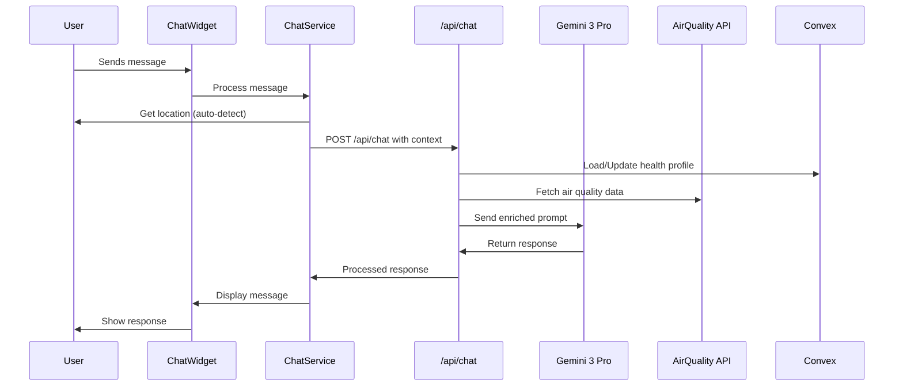

# Chatbot Widget Architecture for Air Quality Monitoring

## Overview

This document outlines the architecture for an AI-powered chatbot widget that provides personalized air quality recommendations and health guidance. The chatbot integrates with the existing air quality monitoring system and uses AI to assess situations based on the Air Pollution Index (API) data.

## Component Architecture

### 1. ChatWidget Component

**Location**: `src/components/chatbot/ChatWidget.tsx`

The main UI component that renders:
- Floating chat button (default state)
- Expandable chat panel
- Message input field
- Message history display
- Quick action buttons for common queries

**Key Features**:
- Minimizable/maximizable interface
- Real-time typing indicators
- Responsive design for mobile and desktop
- Location permission handling

### 2. ChatService

**Location**: `src/lib/chatService.ts`

Handles communication with the AI backend and manages chat state:
- Message queue management
- API request/response handling
- Error handling and retry logic
- Session management

### 3. AirQualityIntegration

**Location**: `src/lib/airQualityIntegration.ts`

Bridge between chatbot and existing air quality services:
- Fetches air quality data for user locations
- Processes location-based queries
- Provides health risk assessment data
- Caches air quality data for performance

### 4. MessageStore

**Location**: `src/contexts/ChatContext.tsx`

React context provider for managing chat state:
- Message history
- User profile and health information
- Chat session metadata
- Real-time updates

## API Route Design

### POST `/api/chat`

**Endpoint**: `src/app/api/chat/route.ts`

#### Request Schema

```typescript
interface ChatRequest {
  sessionId?: string;
  message: string;
  userLocation?: {
    lat: number;
    lng: number;
  };
  userProfile?: {
    hasRespiratoryConditions?: boolean;
    conditions?: string[];
    preferences?: {
      language?: string;
      units?: 'metric' | 'imperial';
    };
  };
  context?: {
    previousMessages?: ChatMessage[];
    airQualityData?: AirQualityData;
  };
}
```

#### Response Schema

```typescript
interface ChatResponse {
  success: boolean;
  message: string;
  recommendations?: {
    type: 'health' | 'route' | 'activity' | 'general';
    priority: 'high' | 'medium' | 'low';
    content: string;
  }[];
  airQualityData?: {
    location: string;
    aqi: number;
    pollutants: {
      pm25?: number;
      no2?: number;
      co?: number;
      o3?: number;
      so2?: number;
    };
    riskLevel: 'low' | 'moderate' | 'high';
    source: string;
  };
  followUpQuestions?: string[];
  healthProfileUpdated?: boolean;
}
```

#### Error Handling

- Rate limiting: 60 requests per minute per IP
- Input validation with detailed error messages
- Graceful degradation when AI service is unavailable
- Fallback responses for common queries

## Conversation Flow Design

### Initial Greeting and Health Assessment

1. **First Interaction**:
   - Friendly greeting introducing the chatbot
   - Auto-detect user location (with fallback to manual input)
   - Request permission to access location
   - Ask about respiratory conditions if not already known

2. **Health Assessment Flow**:
   ```mermaid
   graph TD
     A[User opens chat] --> B{Location known?}
     B -->|No| C[Request location]
     C --> D[Fetch air quality]
     B -->|Yes| D
     D --> E{Health profile exists?}
     E -->|No| F[Ask about respiratory conditions]
     F --> G[Update health profile]
     E -->|Yes| H[Provide personalized recommendations]
     G --> H
     H --> I[Wait for user query]
   ```

### Query Processing Flow

1. **User Input Analysis**:
   - Extract location mentions
   - Identify health-related concerns
   - Detect request type (route, location assessment, health advice)

2. **Context Enrichment**:
   - Fetch current air quality for mentioned locations
   - Apply user's health profile to context
   - Consider historical data if relevant

3. **AI Response Generation**:
   - Use Gemini 3 Pro with custom system prompt
   - Include air quality data in context
   - Generate personalized recommendations
   - Format response with clear structure

### Personalized Recommendation Logic

Based on health status and air quality:

| AQI Range | No Respiratory Issues | With Respiratory Issues |
|-----------|----------------------|------------------------|
| 0-50 (Good) | Safe for all activities | Safe for all activities |
| 51-100 (Moderate) | Sensitive individuals should consider reducing prolonged outdoor exertion | Consider reducing prolonged outdoor exertion |
| 101-150 (Unhealthy for Sensitive) | Reduce prolonged outdoor exertion | Avoid prolonged outdoor exertion |
| 151-200 (Unhealthy) | Avoid prolonged outdoor exertion | Stay indoors |
| 201+ (Very Unhealthy/Hazardous) | Stay indoors | Stay indoors, consider air purifier |

## AI System Prompt

```typescript
const SYSTEM_PROMPT = `You are Air Quality Assistant, an AI assistant specialized in providing personalized air quality recommendations and health advice.

Your core responsibilities:
1. Always consider the user's respiratory health status when providing recommendations
2. Use real-time air quality data to inform your advice
3. Provide location-specific air quality assessments
4. Suggest safer routes when air quality varies by location
5. Give actionable health recommendations based on current conditions

Health Risk Levels:
- Low (AQI 75+): Generally safe for all activities
- Moderate (AQI 45-74): Sensitive individuals should take precautions
- High (AQI <45): Everyone should take precautions

For users with respiratory conditions:
- Be extra cautious with recommendations
- Suggest indoor alternatives when AQI is below 100
- Recommend wearing masks (N95/FFP2) for outdoor activities
- Suggest best times for outdoor activities (typically early morning)

Data Sources:
- Primary: DOE Malaysia (Department of Environment)
- Fallback: WAQI (World Air Quality Index)

Always:
1. Ask about respiratory conditions on first interaction if not known
2. Provide specific, actionable advice
3. Consider the user's location when assessing air quality
4. Update recommendations based on real-time data
5. Be empathetic and supportive

Response Format:
- Start with a friendly greeting (for new conversations)
- Provide clear air quality assessment
- Give specific recommendations based on health status
- Offer follow-up questions if needed
- Keep responses concise but informative

Example response structure:
"Hi! I can help you understand air quality conditions and how they might affect you.

Current air quality in [Location]:
- AQI: [value] ([risk level])
- Main pollutants: [list]

Based on your respiratory condition status:
[Personalized recommendations]

Would you like to know about [follow-up suggestion]?"`;
```

## Data Flow Diagram



## File Structure

```
src/
├── app/
│   └── api/
│       └── chat/
│           └── route.ts              # Chat API endpoint
├── components/
│   └── chatbot/
│       ├── ChatWidget.tsx            # Main chat component
│       ├── ChatMessage.tsx           # Message display component
│       ├── ChatInput.tsx             # Input field component
│       ├── LocationPrompt.tsx        # Location permission UI
│       └── QuickActions.tsx          # Quick action buttons
├── contexts/
│   └── ChatContext.tsx               # Chat state management
├── lib/
│   ├── chatService.ts                # Chat communication layer
│   ├── airQualityIntegration.ts      # Air quality data integration
│   └── aiClient.ts                   # AI API client
├── types/
│   └── chat.ts                       # Chat-related type definitions
└── hooks/
    └── useChat.ts                    # Custom chat hook

convex/
└── air/
    ├── chatSessions.ts               # Session storage
    ├── userProfiles.ts               # Health profile storage
    └── chatHistory.ts                # Message history storage
```

## Integration Points

### 1. Main Application Integration

Add ChatWidget to the root layout:

```typescript
// src/app/layout.tsx
import { ChatWidget } from '@/components/chatbot/ChatWidget';

export default function RootLayout({
  children,
}: {
  children: React.ReactNode;
}) {
  return (
    <html lang="en">
      <body>
        <ChatProvider>
          {children}
          <ChatWidget />
        </ChatProvider>
      </body>
    </html>
  );
}
```

### 2. Convex Integration

New collections for chat data:

```typescript
// convex/air/schema.ts additions
export default defineSchema({
  // Existing collections...
  
  chatSessions: defineTable({
    userId: v.id("users"),
    sessionId: v.string(),
    createdAt: v.number(),
    lastActivity: v.number(),
    isActive: v.boolean(),
  }).index("by_userId", ["userId"]),
  
  userHealthProfiles: defineTable({
    userId: v.id("users"),
    hasRespiratoryConditions: v.boolean(),
    conditions: v.array(v.string()),
    createdAt: v.number(),
    updatedAt: v.number(),
  }).index("by_userId", ["userId"]),
  
  chatMessages: defineTable({
    sessionId: v.id("chatSessions"),
    userId: v.id("users"),
    content: v.string(),
    role: v.union(v.literal("user"), v.literal("assistant")),
    timestamp: v.number(),
    metadata: v.optional(v.any()),
  }).index("by_session", ["sessionId"]),
});
```

## Type Definitions

### Core Chat Types

```typescript
// src/types/chat.ts

export interface ChatMessage {
  id: string;
  sessionId: string;
  userId: string;
  content: string;
  role: 'user' | 'assistant';
  timestamp: number;
  metadata?: {
    airQualityData?: AirQualityData;
    recommendations?: Recommendation[];
    location?: Location;
  };
}

export interface ChatSession {
  id: string;
  userId: string;
  sessionId: string;
  createdAt: number;
  lastActivity: number;
  isActive: boolean;
  messageCount: number;
}

export interface HealthProfile {
  userId: string;
  hasRespiratoryConditions: boolean;
  conditions: RespiratoryCondition[];
  severity: 'mild' | 'moderate' | 'severe';
  medications?: string[];
  doctorRecommendations?: string;
  createdAt: number;
  updatedAt: number;
}

export interface RespiratoryCondition {
  id: string;
  name: string;
  diagnosedDate?: string;
  isControlled: boolean;
}

export interface Recommendation {
  type: 'health' | 'route' | 'activity' | 'general';
  priority: 'high' | 'medium' | 'low';
  title: string;
  content: string;
  actionableSteps?: string[];
  relatedAQI?: number;
}

export interface ChatbotResponse {
  success: boolean;
  message: string;
  recommendations?: Recommendation[];
  airQualityData?: {
    location: string;
    aqi: number;
    pollutants: {
      pm25?: number;
      no2?: number;
      co?: number;
      o3?: number;
      so2?: number;
    };
    riskLevel: 'low' | 'moderate' | 'high';
    source: string;
  };
  followUpQuestions?: string[];
  needsLocationPermission?: boolean;
  healthProfileUpdated?: boolean;
}

export interface ChatContextType {
  messages: ChatMessage[];
  currentSession: ChatSession | null;
  healthProfile: HealthProfile | null;
  isLoading: boolean;
  error: string | null;
  sendMessage: (message: string) => Promise<void>;
  updateHealthProfile: (profile: Partial<HealthProfile>) => Promise<void>;
  clearSession: () => void;
  hasLocationPermission: boolean;
  requestLocationPermission: () => Promise<boolean>;
}
```

## Performance Considerations

1. **Caching Strategy**:
   - Air quality data: 5-minute cache
   - User location: 1-minute cache
   - Health profile: Persistent in Convex

2. **Optimizations**:
   - Lazy load chat widget component
   - Debounce message inputs
   - Implement pagination for message history
   - Use React.memo for message components

3. **Error Boundaries**:
   - Wrap chat widget in error boundary
   - Provide fallback UI when services are unavailable

## Security and Privacy

1. **Data Protection**:
   - Health information encrypted in Convex
   - Location data not stored permanently
   - Chat history optionally deletable

2. **API Security**:
   - Rate limiting per user/IP
   - Input sanitization
   - CORS configuration
   - Environment variables for API keys

3. **User Consent**:
   - Clear privacy notice for health data
   - Option to disable health profile
   - Data export/deletion capabilities

## Testing Strategy

1. **Unit Tests**:
   - ChatService methods
   - Message formatting
   - Type validations

2. **Integration Tests**:
   - API endpoint responses
   - Air quality data fetching
   - Convex operations

3. **E2E Tests**:
   - Complete conversation flows
   - Location permission handling
   - Health profile updates

## Future Enhancements

1. **Advanced Features**:
   - Voice input/output support
   - Predictive recommendations
   - Air quality alerts and notifications
   - Multi-language support

2. **Analytics**:
   - Conversation analytics
   - User engagement metrics
   - Recommendation effectiveness tracking

3. **Integrations**:
   - Calendar integration for activity planning
   - Weather data correlation
   - Wearable device integration for health monitoring